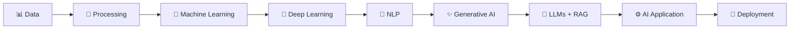
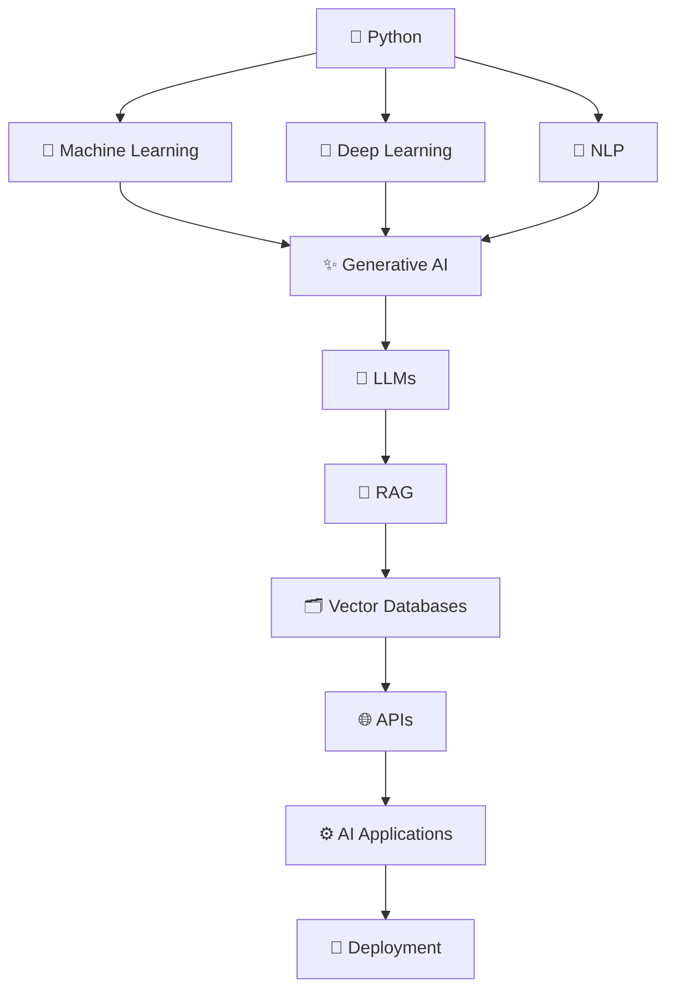

<h1>👋 Hi, I'm Bhavesh</h1>

<h3>Building intelligent systems with Python, Machine Learning & Generative AI.</h3>

 

  

 

---

<h2 align="center">🧠 ABOUT ME</h2>

I build <b>AI-powered applications</b> by combining Machine Learning, Deep Learning, 
Natural Language Processing and Generative AI with practical software engineering.

My focus is on turning AI concepts into <b>working, usable applications</b> —
from data and model development to LLM applications, RAG pipelines, APIs and deployment.

 

<table>
<tr>
<td align="center" width="33%">

🤖 
<b>AI / ML</b> 
Machine Learning 
Deep Learning 
NLP

</td>

<td align="center" width="33%">

🧠 
<b>Generative AI</b> 
LLMs 
RAG 
Vector Databases

</td>

<td align="center" width="33%">

⚙️ 
<b>AI Engineering</b> 
Python 
APIs 
AI Applications

</td>
</tr>
</table>

---

<h2 align="center">⚡ HOW I BUILD AI SYSTEMS</h2>

---

<h2 align="center">🚀 FEATURED PROJECTS</h2>

<h3>🎨 AI SVG STUDIO</h3>

<b>Generative AI Powered SVG Design Platform</b>

  

 

AI-powered application that converts a user's design prompt into a structured design specification and generates scalable SVG graphics using reusable Python-based templates.

### ✨ What it does

- 🤖 Gemini-powered design specification generation
- 🎨 Multiple visual styles and templates
- 🧩 Reusable SVG rendering architecture
- 📦 Single & batch SVG generation
- 👁️ Live SVG preview
- 📥 SVG / ZIP / JSON downloads
- 💬 Session-based AI workflow

**Stack:** `Python` `Gemini` `Generative AI` `LangChain` `SVG` `Streamlit`

  

<h3>🛡️ SPAMSHIELD AI</h3>

<b>NLP-Based Spam / Ham Classification System</b>

  

 

Machine Learning application that classifies text messages as **Spam or Ham** using text preprocessing, TF-IDF feature extraction and Random Forest classification.

### ✨ What it does

- 🧹 Text preprocessing
- 🔤 TF-IDF feature extraction
- 🌲 Random Forest classification
- 🎯 Custom prediction threshold
- 🌐 Flask web application
- 📊 Probability-based predictions
- 📁 Git LFS model tracking

**Stack:** `Python` `NLP` `TF-IDF` `Random Forest` `Flask` `NLTK`

  

<h3>📊 AMBITIONBOX JOB ANALYSIS</h3>

<b>Data Analysis & Job Market Insights</b>

  

 

Data analytics project focused on cleaning, exploring and visualizing job and company information to identify useful patterns and insights.

**Focus:** `Python` `Pandas` `NumPy` `Matplotlib` `EDA` `Data Analysis`

---

<h2 align="center">💼 PROFESSIONAL EXPERIENCE</h2>

<table>
<tr>

<td width="50%" valign="top">

<h3>🤖 Grass Solutions</h3>

<b>AI / ML Training & Internship</b>

  

📅 <b>Aug 2025 — Jun 2026</b>

  

Worked on practical Artificial Intelligence and Machine Learning concepts with hands-on exposure to modern AI application development.

  

<b>Focus Areas</b>

  

🧠 Machine Learning 
🧠 Deep Learning 
✨ Generative AI 
🧠 LLM Applications 
🔎 RAG 
🗂️ Vector Databases 
🔗 LangChain 
⚡ FAISS

</td>

<td width="50%" valign="top">

<h3>🧠 Proftcode AI</h3>

<b>Artificial Intelligence Intern</b>

  

📅 <b>Jun 2026 — Aug 2026</b>

  

Worked on practical AI development with hands-on exposure to data processing, model experimentation and AI application development.

  

<b>Focus Areas</b>

  

🐍 Python 
🤖 Artificial Intelligence 
📊 Machine Learning 
🧠 Model Development 
🔎 Data Processing 
⚙️ AI Applications

</td>

</tr>
</table>

---

<h2 align="center">🧰 TECH STACK</h2>

<h3>👨‍💻 Programming</h3>

  

<h3>🤖 AI / Machine Learning</h3>

  

<code>Machine Learning</code>
<code>Deep Learning</code>
<code>NLP</code>
<code>Generative AI</code>
<code>LLMs</code>
<code>RAG</code>

  

<h3>🧠 Generative AI</h3>

<code>LangChain</code>
<code>FAISS</code>
<code>Vector Databases</code>
<code>Prompt Engineering</code>
<code>Gemini</code>

  

<h3>📊 Data & Analytics</h3>

  

<code>Pandas</code>
<code>NumPy</code>
<code>Matplotlib</code>
<code>Seaborn</code>
<code>Power BI</code>
<code>SQL</code>

  

<h3>🌐 Development & Tools</h3>

  

<code>REST APIs</code>
<code>Flask</code>
<code>Streamlit</code>
<code>Git</code>
<code>GitHub</code>
<code>Postman</code>

---

<h2 align="center">🧠 AI ENGINEERING MAP</h2>

---

<h2 align="center">🔬 CURRENTLY EXPLORING</h2>

<table>
<tr>

<td align="center" width="25%">

🤖

 

<b>Generative AI</b>

</td>

<td align="center" width="25%">

🧠

 

<b>LLM Applications</b>

</td>

<td align="center" width="25%">

🔎

 

<b>RAG & Vector Search</b>

</td>

<td align="center" width="25%">

⚙️

 

<b>AI Applications</b>

</td>

</tr>
</table>

---

<h2 align="center">📜 CERTIFICATIONS & LEARNING</h2>

| 🎓 Program | 🔹 Area |
|:---|:---|
| Deloitte — Data Analytics Job Simulation | Data Analytics |
| Euron — Python Mastery | Python |
| Proftcode AI — Artificial Intelligence Internship | Artificial Intelligence |
| Google Data Analytics | Data Analytics |
| IBM Data Science | Data Science |
| Microsoft Power BI | Business Intelligence |
| Google Digital Marketing | Digital Marketing |
| C Programming Certification | Programming |
| Blind Coding — Techno Aagaaz | Programming |

---

<h2 align="center">📊 GITHUB ANALYTICS</h2>

  

---

<h2 align="center">🐍 CONTRIBUTION JOURNEY</h2>

---

<h2 align="center">🏆 GITHUB ACHIEVEMENTS</h2>

---

<h2 align="center">📌 FEATURED REPOSITORIES</h2>

 

---

<h2 align="center">🎯 OPEN TO OPPORTUNITIES</h2>

<h3>AI Engineer · Machine Learning Engineer · Data Scientist · Generative AI · Python Developer</h3>

 

Interested in building <b>AI-powered products, intelligent automation systems, LLM applications and data-driven solutions.</b>

---

<h2 align="center">🤝 LET'S CONNECT</h2>

  

<b>⚡ Building with AI. Learning continuously. Shipping practical solutions.</b>

  

