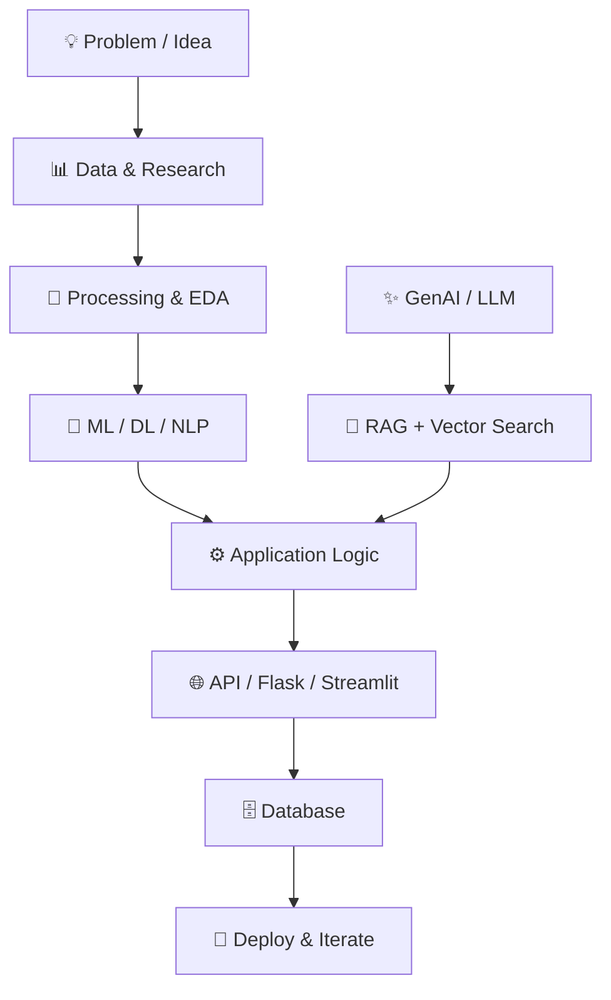

<h1>👋 Hi, I'm Bhavesh</h1>

<h3>Turning data, models and AI into practical software solutions.</h3>

 

  

 

---

<h2 align="center">🧠 ABOUT ME</h2>

I build <b>AI-powered applications</b> by combining Python, Machine Learning, Deep Learning,
NLP and Generative AI with practical software development.

My work spans the complete journey — from <b>data processing and model development</b>
to <b>LLM applications, RAG pipelines, APIs and deployable AI products.</b>

I enjoy understanding how an AI idea works internally and then turning that idea
into something people can actually use.

 

<table>
<tr>

<td align="center" width="25%">

🤖 
<b>Machine Learning</b> 
Models • Features • Evaluation

</td>

<td align="center" width="25%">

🧠 
<b>Deep Learning</b> 
Neural Networks • NLP

</td>

<td align="center" width="25%">

✨ 
<b>Generative AI</b> 
LLMs • RAG • LangChain

</td>

<td align="center" width="25%">

⚙️ 
<b>AI Engineering</b> 
APIs • Flask • Streamlit

</td>

</tr>
</table>

---

<h2 align="center">🚀 MY AI JOURNEY — WHAT I'VE LEARNED & HOW I BUILD</h2>

My learning path has evolved from <b>data and programming</b> to
<b>machine learning, deep learning, NLP and Generative AI</b> —
with a strong focus on converting concepts into working applications.

```mermaid
flowchart LR
    A["🐍 Python<br/>Programming"] --> B["📊 Data<br/>Analysis"]
    B --> C["🤖 Machine<br/>Learning"]
    C --> D["🧠 Deep<br/>Learning"]
    D --> E["💬 NLP"]
    E --> F["✨ Generative<br/>AI"]
    F --> G["🧠 LLMs"]
    G --> H["🔎 RAG<br/>+ Vector Search"]
    H --> I["⚙️ AI<br/>Applications"]
    I --> J["🌐 APIs<br/>Flask / Streamlit"]
    J --> K["🚀 Deployment"]

    style A fill:#0F172A,color:#FFFFFF,stroke:#38BDF8
    style B fill:#172554,color:#FFFFFF,stroke:#60A5FA
    style C fill:#1E3A8A,color:#FFFFFF,stroke:#818CF8
    style D fill:#312E81,color:#FFFFFF,stroke:#A78BFA
    style E fill:#3B0764,color:#FFFFFF,stroke:#C084FC
    style F fill:#4C1D95,color:#FFFFFF,stroke:#C4B5FD
    style G fill:#581C87,color:#FFFFFF,stroke:#D8B4FE
    style H fill:#701A75,color:#FFFFFF,stroke:#F0ABFC
    style I fill:#164E63,color:#FFFFFF,stroke:#67E8F9
    style J fill:#075985,color:#FFFFFF,stroke:#38BDF8
    style K fill:#064E3B,color:#FFFFFF,stroke:#34D399
```

<b>LEARN → EXPERIMENT → BUILD → INTEGRATE → DEPLOY</b>

---

<h2 align="center">🛠️ WHAT I BUILD</h2>

<table>
<tr>

<td align="center" width="20%">

🐍 
<b>Python</b> 
AI Development

</td>

<td align="center" width="20%">

🤖 
<b>ML / DL</b> 
Prediction Systems

</td>

<td align="center" width="20%">

💬 
<b>NLP</b> 
Text Intelligence

</td>

<td align="center" width="20%">

✨ 
<b>GenAI</b> 
LLM Applications

</td>

<td align="center" width="20%">

🌐 
<b>APIs</b> 
Deployable Apps

</td>

</tr>
</table>

 

  

---

<h2 align="center">🚀 FEATURED PROJECTS</h2>

<table>
<tr>

<td width="50%" valign="top">

<h3 align="center">🎨 AI SVG STUDIO</h3>

<b>Generative AI Design Platform</b>

 

AI-powered application that transforms a user's design prompt into structured design specifications and generates scalable SVG graphics through reusable Python templates.

  

<b>Key Capabilities</b>

- 🤖 Gemini-powered design specification
- 🎨 Multiple templates and visual styles
- 🧩 Reusable SVG rendering architecture
- 📦 Single & batch SVG generation
- 👁️ Live SVG preview
- 📥 SVG / ZIP / JSON export
- 💬 Session-based AI workflow

 

<b>Tech</b>

`Python` `Gemini` `Generative AI` `LangChain` `SVG` `Streamlit`

  

</td>

<td width="50%" valign="top">

<h3 align="center">🛡️ SPAMSHIELD AI</h3>

<b>NLP Spam / Ham Classification</b>

 

NLP-based Machine Learning application that classifies text messages as Spam or Ham using preprocessing, TF-IDF feature extraction and Random Forest classification.

  

<b>Key Capabilities</b>

- 🧹 Text preprocessing pipeline
- 🔤 TF-IDF feature extraction
- 🌲 Random Forest classification
- 🎯 Custom prediction threshold
- 🌐 Flask-based web application
- 📊 Probability-based predictions
- 📁 Git LFS model tracking

 

<b>Tech</b>

`Python` `NLP` `TF-IDF` `Random Forest` `Flask` `NLTK`

  

</td>

</tr>

<tr>

<td width="50%" valign="top">

<h3 align="center">📊 AMBITIONBOX JOB ANALYSIS</h3>

<b>Job Market Data Analytics</b>

 

Data analytics project focused on exploring job and company information to identify patterns, trends and useful market insights.

  

<b>Key Areas</b>

- 📊 Dataset exploration
- 🧹 Data cleaning
- 🔍 Exploratory Data Analysis
- 📈 Statistical analysis
- 📉 Data visualization
- 🐼 Pandas-based processing

 

<b>Tech</b>

`Python` `Pandas` `NumPy` `Matplotlib` `EDA` `Data Analysis`

  

</td>

<td width="50%" valign="top">

<h3 align="center">🔬 MORE AI / DATA WORK</h3>

<b>From experiments to practical applications</b>

 

My projects cover multiple layers of the AI development lifecycle:

 

📊 <b>Data Analysis</b> 
Exploration, cleaning and visualization

  

🤖 <b>Machine Learning</b> 
Feature engineering, training and evaluation

  

🧠 <b>Deep Learning</b> 
Neural networks and computer vision

  

💬 <b>NLP</b> 
Text processing and classification

  

✨ <b>Generative AI</b> 
LLMs, RAG and AI-powered applications

  

🌐 <b>Application Layer</b> 
Flask, Streamlit, APIs and databases

</td>

</tr>
</table>

---

<h2 align="center">💼 PROFESSIONAL EXPERIENCE</h2>

<h3>🤖 Grass Solutions</h3>

<b>AI / ML Training & Internship</b>

 

📅 <b>August 2025 — June 2026</b>

Worked through practical Artificial Intelligence and Machine Learning concepts with increasing exposure to modern AI application development. The experience covered the progression from core ML/DL concepts to Generative AI and LLM-based application workflows.

<b>Key Areas Explored</b>

- 🤖 Machine Learning concepts, model development and evaluation
- 🧠 Deep Learning workflows and neural-network based approaches
- 💬 Natural Language Processing concepts and text-based applications
- ✨ Generative AI and LLM application workflows
- 🔎 Retrieval-Augmented Generation (RAG)
- 🗂️ Vector databases and similarity-based retrieval
- ⚡ FAISS for vector search and retrieval workflows
- 🔗 LangChain for LLM application orchestration
- ⚙️ Practical experimentation with AI application development
- 🐍 Python-based implementation of AI concepts

`Machine Learning` `Deep Learning` `NLP` `Generative AI` `LLMs` `RAG` `FAISS` `LangChain`

 

---

<h3>🧠 Proftcode AI</h3>

<b>Artificial Intelligence Intern</b>

 

📅 <b>June 2026 — August 2026</b>

Worked as an Artificial Intelligence Intern with practical exposure to Python-based AI development, data processing, model experimentation and application-oriented AI workflows.

<b>Key Areas Explored</b>

- 🐍 Python-based AI development
- 🤖 Artificial Intelligence and Machine Learning workflows
- 📊 Data processing and preparation
- 🧠 Model development and experimentation
- ⚙️ AI application development
- 🔬 Practical implementation of AI concepts
- 🧩 Connecting AI/ML concepts with application-level solutions

`Python` `Artificial Intelligence` `Machine Learning` `Data Processing` `Model Development` `AI Applications`

---

<h2 align="center">🧰 TECH STACK</h2>

<h3>🐍 Programming</h3>

  

<h3>🤖 Machine Learning & Deep Learning</h3>

  

  

<h3>✨ Generative AI & LLM Engineering</h3>

  

<h3>📊 Data & Analytics</h3>

  

<h3>🌐 Backend, APIs & Applications</h3>

  

<h3>🗄️ Databases</h3>

  

<h3>🛠️ Development Tools</h3>

---

<h2 align="center">🔬 HOW I TURN AI CONCEPTS INTO APPLICATIONS</h2>

<b>Understand → Experiment → Engineer → Integrate → Deploy → Improve</b>

---

<h2 align="center">📚 CURRENTLY EXPLORING</h2>

 

Exploring how modern AI systems move beyond individual models
into <b>context-aware, retrieval-enabled and application-ready systems.</b>

---

<h2 align="center">📜 CERTIFICATIONS & LEARNING</h2>

| 🎓 Program | 🔹 Area |
|:---|:---|
| Deloitte — Data Analytics Job Simulation | Data Analytics |
| Euron — Python Mastery | Python |
| Proftcode AI — Artificial Intelligence Internship | Artificial Intelligence |
| Google Data Analytics | Data Analytics |
| IBM Data Science | Data Science |
| Microsoft Power BI | Business Intelligence |
| Google Digital Marketing | Digital Marketing |
| C Programming Certification | Programming |
| Blind Coding — Techno Aagaaz | Programming |

---

<h2 align="center">📊 GITHUB ANALYTICS</h2>

  

---

<h2 align="center">🗂️ MY PROJECT PORTFOLIO</h2>

 

 

---

<h2 align="center">🐍 CONTRIBUTION JOURNEY</h2>

---

<h2 align="center">🏆 GITHUB ACHIEVEMENTS</h2>

---

<h2 align="center">🎯 WHAT I'M LOOKING FOR</h2>

  

Interested in building <b>AI-powered products, intelligent automation systems,
LLM applications, machine learning solutions and data-driven software.</b>

---

<h2 align="center">🤝 LET'S CONNECT</h2>

  

<b>⚡ Building with AI. Learning continuously. Shipping practical solutions.</b>

  

