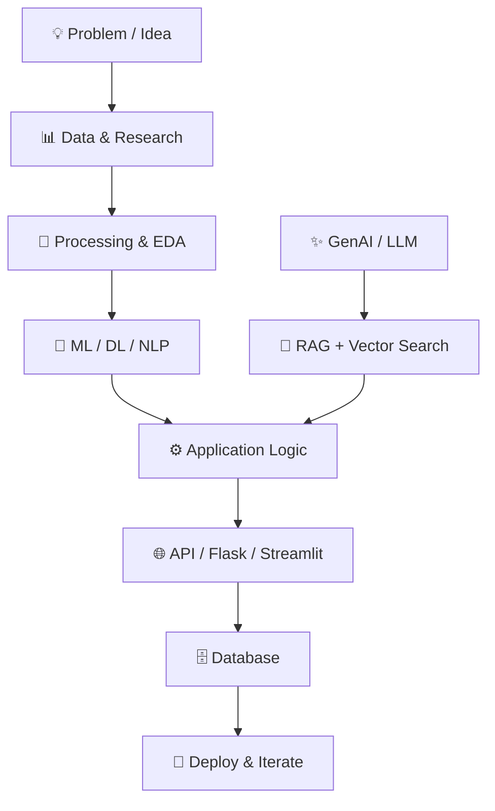

<div align="center">


<h1>👋 Hi, I'm Bhavesh</h1>

<h3>Turning data, models and AI into practical software solutions.</h3>

<br>

<a href="https://www.linkedin.com/in/bhavesh-mulchandani-085759277/">

</a>

<a href="mailto:bhaveshmulchandani651@gmail.com">

</a>

<a href="https://github.com/Bhavesh950">

</a>

<br><br>


</div>

<br>

---

<h2 align="center">🧠 ABOUT ME</h2>

<p align="center">
I build <b>AI-powered applications</b> by combining Python, Machine Learning, Deep Learning,
NLP and Generative AI with practical software development.
</p>

<p align="center">
My work spans the complete journey — from <b>data processing and model development</b>
to <b>LLM applications, RAG pipelines, APIs and deployable AI products.</b>
</p>

<p align="center">
I enjoy understanding how an AI idea works internally and then turning that idea
into something people can actually use.
</p>

<br>

<div align="center">

<table>
<tr>

<td align="center" width="25%">

🤖<br>
<b>Machine Learning</b><br>
Models • Features • Evaluation

</td>

<td align="center" width="25%">

🧠<br>
<b>Deep Learning</b><br>
Neural Networks • NLP

</td>

<td align="center" width="25%">

✨<br>
<b>Generative AI</b><br>
LLMs • RAG • LangChain

</td>

<td align="center" width="25%">

⚙️<br>
<b>AI Engineering</b><br>
APIs • Flask • Streamlit

</td>

</tr>
</table>

</div>

---

<h2 align="center">🚀 MY AI JOURNEY — WHAT I'VE LEARNED & HOW I BUILD</h2>

<p align="center">
My learning path has evolved from <b>data and programming</b> to
<b>machine learning, deep learning, NLP and Generative AI</b> —
with a strong focus on converting concepts into working applications.

```mermaid
flowchart LR
    A["🐍 Python<br/>Programming"] --> B["📊 Data<br/>Analysis"]
    B --> C["🤖 Machine<br/>Learning"]
    C --> D["🧠 Deep<br/>Learning"]
    D --> E["💬 NLP"]
    E --> F["✨ Generative<br/>AI"]
    F --> G["🧠 LLMs"]
    G --> H["🔎 RAG<br/>+ Vector Search"]
    H --> I["⚙️ AI<br/>Applications"]
    I --> J["🌐 APIs<br/>Flask / Streamlit"]
    J --> K["🚀 Deployment"]

    style A fill:#0F172A,color:#FFFFFF,stroke:#38BDF8
    style B fill:#172554,color:#FFFFFF,stroke:#60A5FA
    style C fill:#1E3A8A,color:#FFFFFF,stroke:#818CF8
    style D fill:#312E81,color:#FFFFFF,stroke:#A78BFA
    style E fill:#3B0764,color:#FFFFFF,stroke:#C084FC
    style F fill:#4C1D95,color:#FFFFFF,stroke:#C4B5FD
    style G fill:#581C87,color:#FFFFFF,stroke:#D8B4FE
    style H fill:#701A75,color:#FFFFFF,stroke:#F0ABFC
    style I fill:#164E63,color:#FFFFFF,stroke:#67E8F9
    style J fill:#075985,color:#FFFFFF,stroke:#38BDF8
    style K fill:#064E3B,color:#FFFFFF,stroke:#34D399
```

</p>



<div align="center">

<b>LEARN → EXPERIMENT → BUILD → INTEGRATE → DEPLOY</b>

</div>

---

<h2 align="center">🛠️ WHAT I BUILD</h2>

<p align="center">
  <b>Practical AI systems that turn data, models and intelligence into usable applications.</b>
</p>

<br>

<div align="center">

<table>

<tr>

<td align="center" width="33%">

🤖<br>
<b>MACHINE LEARNING SOLUTIONS</b>

<br><br>

Prediction Systems<br>
Classification • Feature Engineering<br>
Model Evaluation

</td>

<td align="center" width="33%">

🧠<br>
<b>DEEP LEARNING SYSTEMS</b>

<br><br>

Neural Network Solutions<br>
Computer Vision • CNNs<br>
Image Intelligence

</td>

<td align="center" width="33%">

💬<br>
<b>NLP APPLICATIONS</b>

<br><br>

Text Intelligence<br>
Text Classification • NLP Workflows<br>
Language-Based Systems

</td>

</tr>

<tr>

<td align="center" width="33%">

✨<br>
<b>GENERATIVE AI APPLICATIONS</b>

<br><br>

LLM-Powered Solutions<br>
AI Assistants • Content Generation<br>
Intelligent Workflows

</td>

<td align="center" width="33%">

🔎<br>
<b>RAG & KNOWLEDGE SYSTEMS</b>

<br><br>

Context-Aware AI<br>
Embeddings • Vector Search<br>
Retrieval-Based Applications

</td>

<td align="center" width="33%">

⚙️<br>
<b>AI-POWERED SOFTWARE</b>

<br><br>

Practical AI Products<br>
APIs • Web Applications<br>
Deployable Solutions

</td>

</tr>

</table>

</div>

<br>

---

---

<h2 align="center">🧩 AI ENGINEERING FOCUS</h2>

<p align="center">
  <b>Areas where I combine AI concepts with practical software engineering.</b>
</p>

<br>

<div align="center">

<table>

<tr>

<td align="center" width="33%">

📊<br>
<b>DATA & MACHINE LEARNING</b>

<br><br>

Data Processing<br>
EDA • Feature Engineering<br>
Model Development • Evaluation

</td>

<td align="center" width="33%">

🧠<br>
<b>DEEP LEARNING & NLP</b>

<br><br>

Neural Networks<br>
CNN • NLP • Text Classification<br>
Model Inference

</td>

<td align="center" width="33%">

✨<br>
<b>GENERATIVE AI</b>

<br><br>

LLM Applications<br>
Prompt Engineering • Gemini<br>
LangChain Workflows

</td>

</tr>

<tr>

<td align="center" width="33%">

🔎<br>
<b>RAG & RETRIEVAL</b>

<br><br>

Embeddings<br>
Vector Search • FAISS<br>
Context Retrieval

</td>

<td align="center" width="33%">

⚙️<br>
<b>AI APPLICATION ENGINEERING</b>

<br><br>

AI Workflows<br>
Flask • Streamlit • REST APIs<br>
Application Integration

</td>

<td align="center" width="33%">

🚀<br>
<b>DATA & APPLICATION LAYER</b>

<br><br>

SQL • MySQL • MongoDB<br>
Backend Integration<br>
Deployable AI Applications

</td>

</tr>

</table>

</div>

<br>

<div align="center">


</div>

<br>

---

---

<h2 align="center">💼 PROFESSIONAL EXPERIENCE</h2>

<div align="center">

<h3>🤖 Grass Solutions</h3>

<b>AI / ML Training & Internship</b>

<br>

📅 <b>August 2025 — June 2026</b>

</div>

Worked through practical Artificial Intelligence and Machine Learning concepts with increasing exposure to modern AI application development. The experience covered the progression from core ML/DL concepts to Generative AI and LLM-based application workflows.

<b>Key Areas Explored</b>

- 🤖 Machine Learning concepts, model development and evaluation
- 🧠 Deep Learning workflows and neural-network based approaches
- 💬 Natural Language Processing concepts and text-based applications
- ✨ Generative AI and LLM application workflows
- 🔎 Retrieval-Augmented Generation (RAG)
- 🗂️ Vector databases and similarity-based retrieval
- ⚡ FAISS for vector search and retrieval workflows
- 🔗 LangChain for LLM application orchestration
- ⚙️ Practical experimentation with AI application development
- 🐍 Python-based implementation of AI concepts

<div align="center">

`Machine Learning` `Deep Learning` `NLP` `Generative AI` `LLMs` `RAG` `FAISS` `LangChain`

</div>

<br>

---

<div align="center">

<h3>🧠 Proftcode AI</h3>

<b>Artificial Intelligence Intern</b>

<br>

📅 <b>June 2026 — August 2026</b>

</div>

Worked as an Artificial Intelligence Intern with practical exposure to Python-based AI development, data processing, model experimentation and application-oriented AI workflows.

<b>Key Areas Explored</b>

- 🐍 Python-based AI development
- 🤖 Artificial Intelligence and Machine Learning workflows
- 📊 Data processing and preparation
- 🧠 Model development and experimentation
- ⚙️ AI application development
- 🔬 Practical implementation of AI concepts
- 🧩 Connecting AI/ML concepts with application-level solutions

<div align="center">

`Python` `Artificial Intelligence` `Machine Learning` `Data Processing` `Model Development` `AI Applications`

</div>

---

<h2 align="center">🧰 TECH STACK</h2>

<div align="center">

<h3>🐍 Programming</h3>


<br><br>

<h3>🤖 Machine Learning & Deep Learning</h3>


<br><br>


<br><br>

<h3>✨ Generative AI & LLM Engineering</h3>


<br><br>

<h3>📊 Data & Analytics</h3>


<br><br>

<h3>🌐 Backend, APIs & Applications</h3>


<br><br>

<h3>🗄️ Databases</h3>


<br><br>

<h3>🛠️ Development Tools</h3>


</div>

---

<h2 align="center">🔬 HOW I TURN AI CONCEPTS INTO APPLICATIONS</h2>



<div align="center">

<b>Understand → Experiment → Engineer → Integrate → Deploy → Improve</b>

</div>

---

<h2 align="center">📚 CURRENTLY EXPLORING</h2>

<div align="center">


</div>

<br>

<p align="center">
Exploring how modern AI systems move beyond individual models
into <b>context-aware, retrieval-enabled and application-ready systems.</b>
</p>

---

<h2 align="center">📜 CERTIFICATIONS & LEARNING</h2>

<div align="center">

| 🎓 Program | 🔹 Area |
|:---|:---|
| Deloitte — Data Analytics Job Simulation | Data Analytics |
| Euron — Python Mastery | Python |
| Proftcode AI — Artificial Intelligence Internship | Artificial Intelligence |
| Google Data Analytics | Data Analytics |
| IBM Data Science | Data Science |
| Microsoft Power BI | Business Intelligence |
| Google Digital Marketing | Digital Marketing |
| C Programming Certification | Programming |
| Blind Coding — Techno Aagaaz | Programming |

</div>

---

<h2 align="center">📊 GITHUB ANALYTICS</h2>

<div align="center">

<a href="https://github.com/Bhavesh950">


</a>

<a href="https://github.com/Bhavesh950">


</a>

<br><br>


</div>

---

<h2 align="center">📂 MY PROJECT PORTFOLIO</h2>

<p align="center">
  A collection of projects built across <b>Data Science, Machine Learning, NLP,
  Deep Learning, Generative AI, Backend Development and Analytics.</b>
</p>

<br>

<div align="center">

<table>

<tr>

<td align="center" width="25%">

📊<br>
<b>Data & Analytics</b><br>
EDA • SQL • Visualization

</td>

<td align="center" width="25%">

🤖<br>
<b>Machine Learning</b><br>
Classification • Prediction

</td>

<td align="center" width="25%">

🧠<br>
<b>AI / NLP / DL</b><br>
NLP • CNN • AI Systems

</td>

<td align="center" width="25%">

✨<br>
<b>Generative AI</b><br>
LLMs • RAG • AI Apps

</td>

</tr>

</table>

</div>

<br>

---

<h3 align="center">✨ GENERATIVE AI & INTELLIGENT APPLICATIONS</h3>

<div align="center">

<table>

<tr>

<td width="50%" valign="top">

<h3>🎨 AI SVG Studio</h3>

<b>Generative AI Powered SVG Design Platform</b>

<br><br>

An AI-powered application that converts a user's design prompt into structured design specifications and generates scalable SVG graphics using reusable Python templates.

<br><br>

<b>What I built</b>

- Gemini-powered design specification generation
- Multiple design templates and visual styles
- Reusable SVG rendering architecture
- Single & batch SVG generation
- Live SVG preview
- SVG / ZIP / JSON export
- Session-based AI workflow

<br>

<b>Tech:</b>

`Python` `Gemini` `Generative AI` `LangChain` `SVG` `Streamlit`

<br><br>

<a href="https://ai-svg-studio-mq2tbhebhug3z7aaqfj5b4.streamlit.app/">

</a>

<a href="https://github.com/Bhavesh950/AI-SVG-Studio">

</a>

</td>

<td width="50%" valign="top">

<h3>✈️ Wanderlust AI</h3>

<b>AI Travel Assistant & Trip Planner</b>

<br><br>

A full-stack travel assistant designed to bring destination discovery, travel information and trip planning into one application.

<br><br>

<b>What I explored</b>

- Travel information workflows
- Destination search
- Hotel & flight information
- Weather integration
- Map-based features
- AI-assisted travel experience
- User-facing web application

<br>

<b>Tech:</b>

`Python` `Flask` `MySQL` `APIs` `AI` `HTML` `CSS`

<br><br>

<a href="https://github.com/Bhavesh950/wanderlust-ai">

</a>

</td>

</tr>

</table>

</div>

<br>

---

<h3 align="center">🤖 MACHINE LEARNING & NLP</h3>

<div align="center">

<table>

<tr>

<td width="50%" valign="top">

<h3>🛡️ SpamShield AI</h3>

<b>NLP-Based Spam / Ham Classification System</b>

<br><br>

A Machine Learning application that classifies text messages as Spam or Ham using text preprocessing, TF-IDF feature extraction and Random Forest classification.

<br><br>

<b>What I built</b>

- Text preprocessing pipeline
- TF-IDF feature extraction
- Random Forest classifier
- Probability-based prediction
- Custom prediction threshold
- Flask web application
- Large trained model tracked using Git LFS

<br>

<b>Tech:</b>

`Python` `NLP` `TF-IDF` `Random Forest` `NLTK` `Flask`

<br><br>

<a href="https://github.com/Bhavesh950/Spam_Ham_Classifier_NLP_Project">

</a>

</td>

<td width="50%" valign="top">

<h3>🖼️ Image Classifier</h3>

<b>Deep Learning Image Classification Application</b>

<br><br>

A computer vision application where users can upload an image and receive a model-generated prediction through an interactive interface.

<br><br>

<b>What I explored</b>

- Image preprocessing
- CNN-based classification
- Deep Learning workflow
- Model inference
- Image upload pipeline
- Interactive prediction interface
- Model deployment concepts

<br>

<b>Tech:</b>

`Python` `Deep Learning` `CNN` `Streamlit`

<br><br>

<a href="https://github.com/Bhavesh950/image_classifier">

</a>

<a href="https://imageclassifier-urwoc6evrx6wqpmzrz5tej.streamlit.app/">

</a>

</td>

</tr>

</table>

</div>

<br>

---

<h3 align="center">📊 DATA SCIENCE & ANALYTICS</h3>

<div align="center">

<table>

<tr>

<td width="50%" valign="top">

<h3>📈 AmbitionBox Job Analysis</h3>

<b>Job Market Data Analytics</b>

<br><br>

A data analytics project focused on exploring job and company information to identify patterns, trends and useful insights from collected job-market data.

<br><br>

<b>Analysis Areas</b>

- Dataset exploration
- Data cleaning
- Exploratory Data Analysis
- Statistical analysis
- Company & job insights
- Data visualization
- Pandas-based processing

<br>

<b>Tech:</b>

`Python` `Pandas` `NumPy` `Matplotlib` `Data Analysis`

<br><br>

<a href="https://github.com/Bhavesh950/AmbitionBox-Job-Analysis">

</a>

</td>

<td width="50%" valign="top">

<h3>🎬 IMDb Case Study</h3>

<b>SQL + Python Movie Data Analysis</b>

<br><br>

A data analysis case study focused on extracting insights from movie-related data using SQL and Python.

<br><br>

<b>Analysis Areas</b>

- SQL querying
- Data exploration
- Movie analysis
- Revenue analysis
- Actor analysis
- Trend identification
- Python-based analysis

<br>

<b>Tech:</b>

`SQL` `Python` `Pandas` `Jupyter Notebook` `Data Analysis`

<br><br>

<a href="https://github.com/Bhavesh950/Bhavesh_IMDB_Case_Study">

</a>

</td>

</tr>

</table>

</div>

<br>

---

<h3 align="center">💻 PYTHON APPLICATIONS</h3>

<div align="center">

<table>

<tr>

<td width="50%" valign="top">

<h3>🏦 Banking Application</h3>

<b>Console-Based Banking System</b>

<br><br>

A Python-based banking application implementing core banking operations through a structured console workflow.

<br><br>

<b>Features</b>

- User signup
- Login authentication
- Password validation
- Credit / Debit transactions
- Balance checking
- Password reset
- Function-driven application flow

<br>

<b>Tech:</b>

`Python` `Jupyter Notebook`

<br><br>

<a href="https://github.com/Bhavesh950/Banking-Application">

</a>

</td>

<td width="50%" valign="top">

<h3>📚 Simple Book Recommendation System</h3>

<b>Python-Based Recommendation Program</b>

<br><br>

A function-driven recommendation project that filters a book dataset based on user-selected genres.

<br><br>

<b>What I practiced</b>

- Functions
- Lists
- Dictionaries
- Sets
- Dataset filtering
- User input handling
- Recommendation logic

<br>

<b>Tech:</b>

`Python` `Jupyter Notebook` `Data Handling`

<br><br>

<a href="https://github.com/Bhavesh950/simple-book-recommendation-system">

</a>

</td>

</tr>

</table>

</div>

<br>

---

<h3 align="center">🛒 WEB & DATABASE APPLICATIONS</h3>

<div align="center">

<table>

<tr>

<td width="50%" valign="top">

<h3>🛍️ E-Commerce Application</h3>

<b>Python-Based Application</b>

<br><br>

An application project focused on building practical software functionality using Python and application-level workflows.

<br><br>

<b>Focus</b>

- Application logic
- Python programming
- Structured project development
- User-oriented workflows

<br>

<b>Tech:</b>

`Python`

<br><br>

<a href="https://github.com/Bhavesh950/ecomm">

</a>

</td>

<td width="50%" valign="top">

<h3>🧩 Flask / Database Work</h3>

<b>Backend & Application Engineering</b>

<br><br>

Alongside my individual projects, I have worked with Flask-based applications, SQL databases, APIs, authentication workflows and application-level data handling.

<br><br>

<b>Focus</b>

- Flask application structure
- REST APIs
- MySQL
- SQLAlchemy
- Authentication
- Database operations
- Frontend / backend integration

<br>

<b>Tech:</b>

`Python` `Flask` `MySQL` `SQLAlchemy` `REST APIs`

</td>

</tr>

</table>

</div>

<br>

---

<h3 align="center">🔬 AI / ML PROJECT WORK</h3>

<div align="center">

<table>

<tr>

<td width="50%" valign="top">

<h3>🚨 IEEE-CIS Fraud Detection</h3>

<b>Deep Learning / ANN Fraud Detection</b>

<br><br>

A fraud detection project based on the IEEE-CIS Fraud Detection dataset, exploring data preprocessing, imbalance handling and Artificial Neural Network based classification.

<br><br>

<b>Work Covered</b>

- Transaction + identity data integration
- Missing-value analysis
- Class imbalance analysis
- Categorical feature processing
- Feature preprocessing
- SMOTE-based imbalance handling
- Dimensionality reduction exploration
- ANN model development
- Precision / Recall / AUC evaluation

<br>

<b>Tech:</b>

`Python` `Pandas` `Scikit-learn` `SMOTE` `TensorFlow` `Keras` `ANN`

</td>

<td width="50%" valign="top">

<h3>🧠 Deep Learning & Computer Vision</h3>

<b>Image-Based AI Experiments</b>

<br><br>

Explored deep learning workflows for image classification and computer vision applications, including transfer learning and pretrained CNN architectures.

<br><br>

<b>Concepts Explored</b>

- CNN architectures
- Transfer Learning
- ImageNet
- ResNet
- VGGNet
- MobileNet
- Data Augmentation
- Model Evaluation
- Image Prediction Applications

<br>

<b>Tech:</b>

`Python` `TensorFlow` `Keras` `CNN` `ResNet` `Streamlit`

</td>

</tr>

</table>

</div>

<br>

---

<h3 align="center">🗺️ PROJECT EVOLUTION</h3>

<div align="center">

```text
🐍 Python
      ↓
📊 Data Analysis & SQL
      ↓
🤖 Machine Learning
      ↓
🧠 Deep Learning
      ↓
💬 NLP
      ↓
✨ Generative AI
      ↓
🧠 LLM Applications
      ↓
🔎 RAG & Vector Search
      ↓
⚙️ AI Applications
      ↓
🌐 APIs + Databases
      ↓
🚀 Deployable Solutions
```

</div>

<br>

---

<h3 align="center">📊 PROJECT SKILL MATRIX</h3>

<div align="center">

| Project                   | Python | ML | DL | NLP | GenAI | SQL / DB | Flask | Streamlit |
| ------------------------- | ------ | -- | -- | --- | ----- | -------- | ----- | --------- |
| 🎨 AI SVG Studio          | ✅      | —  | —  | —   | ✅     | —        | —     | ✅         |
| 🛡️ SpamShield AI         | ✅      | ✅  | —  | ✅   | —     | —        | ✅     | —         |
| 🖼️ Image Classifier      | ✅      | —  | ✅  | —   | —     | —        | —     | ✅         |
| 📈 AmbitionBox Analysis   | ✅      | —  | —  | —   | —     | —        | —     | —         |
| 🎬 IMDb Case Study        | ✅      | —  | —  | —   | —     | ✅        | —     | —         |
| ✈️ Wanderlust AI          | ✅      | —  | —  | —   | ✅     | ✅        | ✅     | —         |
| 🚨 Fraud Detection        | ✅      | ✅  | ✅  | —   | —     | —        | —     | —         |
| 🏦 Banking Application    | ✅      | —  | —  | —   | —     | —        | —     | —         |
| 📚 Book Recommendation    | ✅      | —  | —  | —   | —     | —        | —     | —         |
| 🛒 E-Commerce Application | ✅      | —  | —  | —   | —     | —        | —     | —         |

</div>

<br>

---

<div align="center">

<h3>🔎 Want to explore the complete code?</h3>

<a href="https://github.com/Bhavesh950?tab=repositories">


</a>

<br><br>

<b>From notebooks to AI applications — every project represents a step in my learning journey.</b>

</div>

---

<h2 align="center">🐍 CONTRIBUTION JOURNEY</h2>

<div align="center">


</div>

---

<h2 align="center">🏆 GITHUB ACHIEVEMENTS</h2>

<div align="center">


</div>

---

<h2 align="center">🎯 WHAT I'M LOOKING FOR</h2>

<div align="center">


<br><br>

<p>
Interested in building <b>AI-powered products, intelligent automation systems,
LLM applications, machine learning solutions and data-driven software.</b>
</p>

</div>

---

<h2 align="center">🤝 LET'S CONNECT</h2>

<div align="center">

<a href="https://www.linkedin.com/in/bhavesh-mulchandani-085759277/">

</a>

<a href="mailto:bhaveshmulchandani651@gmail.com">

</a>

<a href="https://github.com/Bhavesh950">

</a>

<br><br>

<b>⚡ Building with AI. Learning continuously. Shipping practical solutions.</b>

<br><br>


</div>
